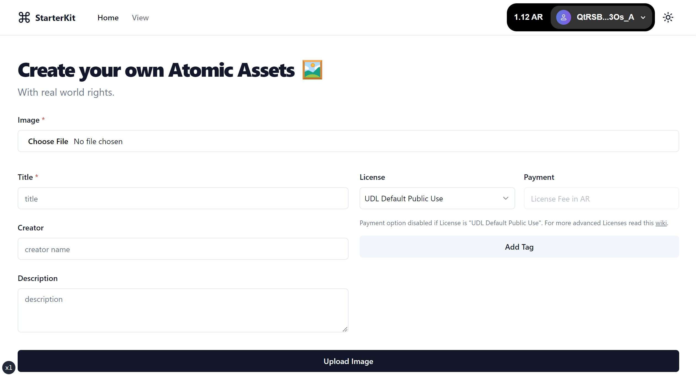
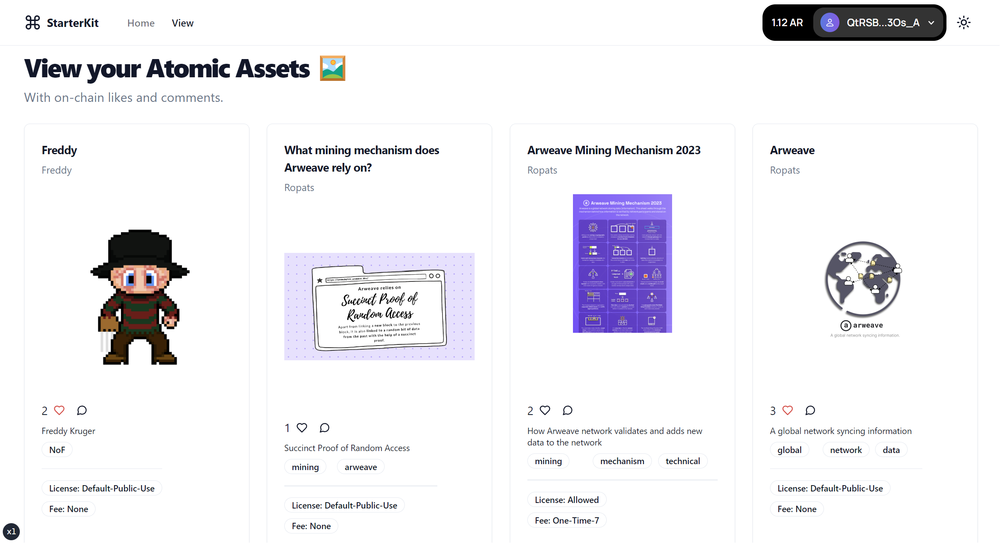

# Arweave StarterKit

Fast track your journey to building decentralized applications on Arweave with the Arweave StarterKit. A CLI tool that effortlessly sets up an entire application, harnessing the power of [NextJS](https://nextjs.org/) as the framework, [Shadcn UI](https://ui.shadcn.com/) for a sleek and aesthetic interface, and [ArweaveKit](https://arweavekit.com/?utm\_source=Github\&utm\_medium=StarterKit+Repo\&utm\_campaign=Create-Arweave-App+StarterKit+Docs\&utm\_id=Create-Arweave-App+StarterKit+Docs) to seamlessly interact with the Arweave ecosystem.

## Usage

### Interactive

To scaffold an Arweave app interactively, run the following command based on your package manager of choice:

### npm

```bash
npx create-arweave-app@latest
# or
npm create arweave-app@latest
```

### yarn

```bash
yarn create arweave-app
```

### pnpm

```bash
pnpm create arweave-app@latest
```

### bun

```bash
bunx create-arweave-app@latest
# or
bun create arweave-app@latest
```

During the interactive setup, you'll be prompted for your project's name and other configuration options. Provide your choices to create a new Arweave application.

> **Note:** For windows users using a secure shell, ensure your ssh-agent is running as expected for successfull installation of dependencies.

### Non-interactive

For a non-interactive setup, use command line arguments. You can view available options with:

```bash
create-arweave-app --help
```

```bash
Usage: create-arweave-app [dir] [options]

A CLI for creating full-stack Arweave web applications

Arguments:
  dir                         The name of the application, as well as the name of the directory to create

Options:
  --noGit                     Explicitely tell the CLI to not initialize a new git repo in the project (default: false)
  --noInstall                 Explicitely tell the CLI to not run the package manager's install command (default: false)
  -y, --default               Bypass the CLI and Use default options to bootstrap a new Arweave app. Note: Default options can be overridden by user-provided options. (default: false)
  -l, --language <type>       Initialize project as a Typescript or JavaScript project (choices: "typescript", "javascript", "ts", "js", default: "typescript")
  -i, --import-alias <alias>  Explicitly tell the CLI to use a custom import alias (default: "@/")
  --appRouter [boolean]       Explicitly tell the CLI to use the new Next.js app router (default: true)
  -v, --version               Display the version number
  -h, --help                  display help for command
```

You can quickly scaffold an Arweave app using the starter kit with the default options by running:

```bash
npx create-arweave-app@latest -y
# or
yarn create arweave-app -y
# or
pnpm create arweave-app@latest -y
# or
bunx create-arweave-app@latest -y
```

You can also quickly scaffold by overriding the default options by passing the other options as well:

```bash
npx create-arweave-app@latest my-arweave-app --noGit --default
# or
yarn create arweave-app my-arweave-app --noGit --default
# or
pnpm create arweave-app@latest my-arweave-app --noGit --default
# or
bunx create-arweave-app@latest my-arweave-app --noGit --default
```

## Getting Started

After creating a new project and installing the dependencies, run the development server:

```bash
npm run dev
# or
yarn dev
# or
pnpm dev
# or
bun dev
```

## Preview

Open [http://localhost:3000](http://localhost:3000) in your browser to see the result.

**Landing Page:** A form that allows users to upload Atomic assets on Arweave, complete with various metadata configurations.



**View Page:** A dedicated space to view the uploaded assets and engage with them through on-chain likes (known as stamps) and comments.



Start editing the page by modifying `app/page.tsx` or `pages/index.ts`, as per your NextJS config.

## Why use a StarterKit?

Building DApps from scratch can be a daunting task. From setting up the environment to ensuring compatibility across different components, the process can be time-consuming. A starter kit provides a pre-configured foundation, enabling developers to focus on building unique features and functionalities rather than the underlying setup.

## What are the key components of the StarterKit?

* **Navbar:** A built-in navigation bar that integrates with [Arweave Wallet Kit](https://docs.arweavekit.com/wallets/wallet-kit?utm\_source=Github\&utm\_medium=StarterKit+Repo\&utm\_campaign=Create-Arweave-App+StarterKit+Docs\&utm\_id=Create-Arweave-App+StarterKit+Docs), enabling users to connect to and interact with the DApp effortlessly.
* **Landing Page:** A landing page featuring a form, typesafed with [Zod](https://zod.dev/) schemas. Users can upload images and add metadata, which is then posted to the Arweave network as an [atomic asset](https://cookbook.arweave.dev/concepts/atomic-tokens.html).
*   **Atomic Assets and Contracts:** Each asset is paired with an associated contract, enabling alterations to the metadata and transfer of ownership.

    The created project is initialized with a contract which is located at `src/contracts`. You can make necessary modifications to the contract code according to your needs and run the script `deploy-contracts` to automatically update the contract linked functionality to the new one.\


    ```bash
    # With wallet.json keyfile present at root
    yarn deploy-contracts
    # With keyfile present at a custom path
    yarn deploy-contracts /Users/arweave/Documents/keys/wallet.json
    ```
* **View Page:** A space to showcase assets and metadata, augmented with features like [Stamps](https://stamps.arweave.dev/#/en/main) (Arweave's version of 'likes') and [on-chain comments](https://specs.ar-io.dev/#/view/SYCrxZYzhP\_L\_iwmxS7niejyeJ\_XhJtN4EArplCPHGQ).

## Leverage Modularity

The true strength of this kit lies in its modularity. Simply interchange the core asset from image to music and transform an image sharing application to a music hub. Or swap in for videos to create a streaming service. As any form of data can be uploaded to the Arweave network, the possibilities are limitless.

## Credits

For a complete list of contributors and credits, please see the [CREDITS](https://github.com/labscommunity/starterkit/blob/main/CREDITS.md) file.

## License

This project is licensed under the [MIT License](https://github.com/labscommunity/starterkit/blob/main/LICENSE).
