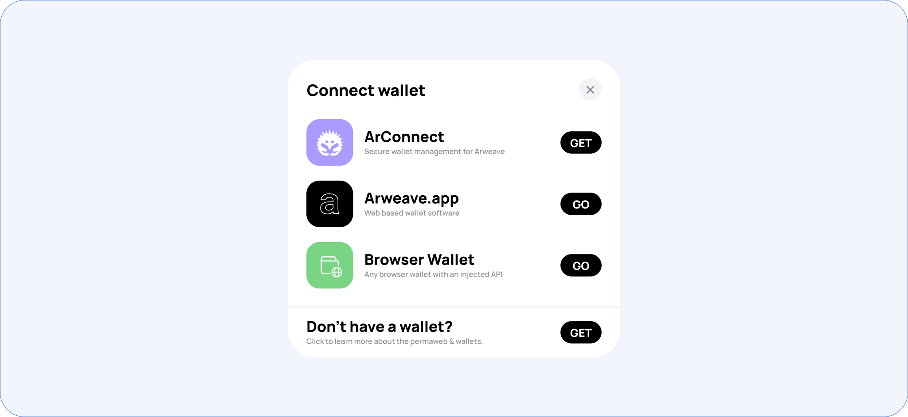

# Wallet Kit

<figure><figcaption></figcaption></figure>


**Note:** The Arweave Wallet Kit is in BETA.


The Arweave Wallet Kit is designed to facilitate interaction between different Arweave wallets and dApps. It provides a unified API that can support any kind of wallet made for Arweave while allowing the user to interact via their favorite wallet.

The library offers a set of React hooks and components with deep ecosystem integration.

## Supported wallets

The library supports any Arweave wallet that injects its ArConnect-like API into `window.arweaveWallet`. The main wallets supported as of now are the following:

* [ArConnect](https://arconnect.io)
* [Arweave.app](https://arweave.app)
* [Othent](https://othent.io/)

## Terminology

The Arweave Wallet Kit supports several _strategies_. The word strategy means **an implementation of an Arweave Wallet** in the Kit. These strategies allow the user to communicate with all wallets the same way and with the same API.
